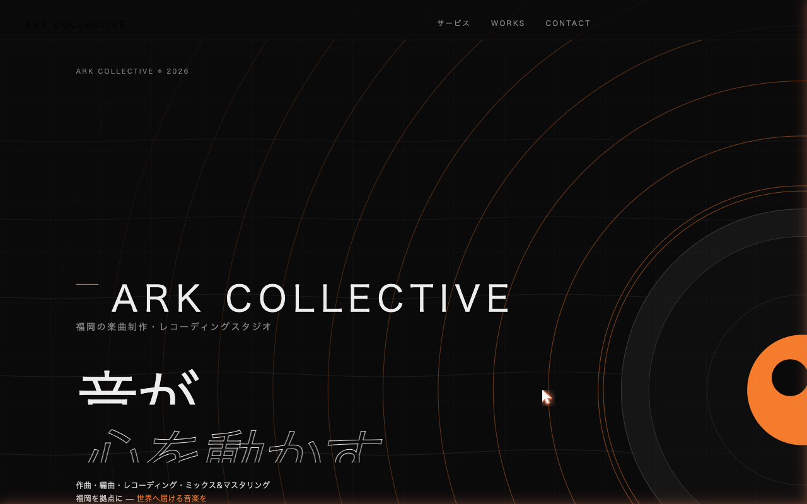

# Ark Collective — Official Website / オフィシャルウェブサイト

[](https://arkcltv.com/)
[](https://kengo0804.github.io/studio-ark-hp/)
[](./LICENSE)

## Overview / 概要

福岡市中央区薬院を拠点とする音楽制作・レコーディングスタジオ **Ark Collective** のオフィシャルウェブサイトです。

楽曲制作・編曲・レコーディング・ミックス&マスタリングを全国対応で提供するための、静的HTMLサイトとして制作しています。

## Live Demo / 公開URL

- Production: https://arkcltv.com/
- GitHub Pages: https://kengo0804.github.io/studio-ark-hp/

## Screenshots / スクリーンショット



## Features / 特徴

- フレームワーク不要の純粋な HTML / CSS / JavaScript で構築
- 日本語・英語の多言語切り替え対応
- スマートフォン・タブレット・PCに対応したレスポンシブデザイン
- OGP、構造化データ、sitemap.xml、robots.txt によるSEO対応
- 無料相談フォーム、送信完了ページ、プライバシーポリシー、利用規約ページを実装

## Tech Stack / 技術スタック

| Category | Technology |
|----------|------------|
| Markup | HTML |
| Styling | CSS |
| Interactions | JavaScript |
| Hosting | Netlify / GitHub Pages |
| SEO | OGP / Structured Data / sitemap.xml / robots.txt |

## Project Structure / ファイル構成

```text
.
├── index.html          # メインページ
├── consultation.html   # 無料相談フォーム
├── thanks.html         # 相談フォーム送信完了ページ
├── privacy.html        # プライバシーポリシー
├── terms.html          # 利用規約
├── sitemap.xml         # 検索エンジン向けサイトマップ
├── robots.txt          # クローラー制御
├── serve.sh            # ローカル開発サーバー起動スクリプト
├── thumbnail.png       # OGPサムネイル画像
├── screenshot.png      # README用スクリーンショット
├── プロフィール写真.jpg  # プロフィール画像
└── Piano House.mp3     # デモ楽曲
```

> `StudioArk.html` は `index.html` の旧ファイルです。

## Getting Started / ローカルで確認する

Python 3 が入っていれば、付属のスクリプトで起動できます。

```bash
bash serve.sh
```

ブラウザで以下を開きます。

```text
http://localhost:8080
```

任意の静的ファイルサーバーでも確認できます。

```bash
npx serve .
```

## Deployment / デプロイ

このリポジトリは静的サイトとしてデプロイ済みです。

| Environment | URL | Purpose |
|-------------|-----|---------|
| Production | https://arkcltv.com/ | 独自ドメインの本番公開URL |
| GitHub Pages | https://kengo0804.github.io/studio-ark-hp/ | GitHub上の公開デモ・Deployment履歴 |

GitHub Pages の `github-pages` environment にデプロイ履歴が残るため、GitHub上でも公開実績を確認できます。

## Services / 対応サービス

| Service | Description |
|---------|-------------|
| 楽曲制作・編曲 | オリジナル楽曲、タイアップ、CM音楽 |
| レコーディング | ボーカル・楽器録音 |
| ミックス&マスタリング | 音源の仕上げ・音質調整 |

対応ジャンル: Pops / House / Hip-hop / R&B / Future Bass / Disco / Afro Beats など

## Contact / お問い合わせ

ウェブサイトの相談フォームよりお問い合わせください。

- Contact Form: https://arkcltv.com/consultation.html

## License / ライセンス

This project is licensed under the MIT License.
ウェブサイトの相談フォーム（[arkcltv.com/consultation.html](https://arkcltv.com/consultation.html)）よりお気軽にご相談ください。
